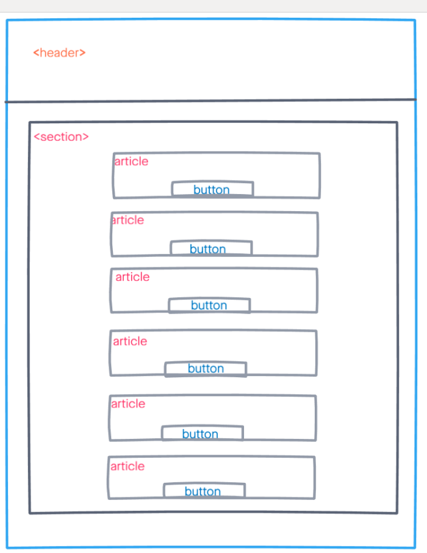

# Development Strategy

> `travel-road`

A basic web page aim to learn js, debugging and developed collaboratively using branches. It's not very interesting to look at.

## Wireframe

## 0. Set-Up

### Repository

- Created a new repository [generated](https://github.com/HackYourFutureBelgium/debugging-project-week-1)
- Clone the repository
- Copy-paste the markdown from this file to the empty `development-strategy.md` file in the new repo
- Add [this wireframe](./jswireframe-1-1.png)
- Start README file
- Push the changes
- turn on GitHub Pages

---

## 1. Reverse&Repeat String

**As a site visitor, I want to see the result of my inputs repeating and reversing**

> assigned to `Mame`  
> reviewers `Oguz` and `Aleksandra`

## Repo

This user story was developed on a branch called `repeat_reverse_string`

### HTML

- Add h2 tags to give a title to the articles
- Add Onlick events to make element dynamics
- Add button tags

### CSS

- style article article5&6
- Add img as background
- Add font family
- Align items to center used flexbox

## JS

- wrote logic for main functions to repeat and reverse strings
- check result of the prompt function then convert to number
- Show result of input to developers via console log

## 4. Find the longest word

**As a site visitor, I want to see the result of my prediction about the longest word in my sentence**

> assigned to `Oguz`  
> reviewers `Mame` and `Aleksandra`

## Repo

This user story was developed on a branch called `longest_word`

### HTML

- Added `h2` tags to give a title to the articles
- Added `p` tag to explain the game or instructions
- Added `form` tag and `input` tag to take user input
- Added `button` tag to compare user input and guess
- With `button` tag user can see the result of his/her guess

### CSS

- Added style features inside the `article` tag with class `article4`
- Added background image to `article` tag with `background-image: url();`
- Added `font` features to `h2`, `p` and `button` tag
- Used `margin`, `display:flex;` and `justify-content: space-evenly;` for nice view

## JS

- Wrote logic for main functions to convert celsius to fahrenheit
- Used `document.getElementById('').value` for take value of user input
- Used `alert` method to show boolean value of result

## Finishing Touches

**As a perfectionist, I want everything perfect :)**

- Write final, complete README:
  - [makeareadme.com](https://www.makeareadme.com/)
  - [bulldogjob](https://bulldogjob.com/news/449-how-to-write-a-good-readme-for-your-github-project)
  - [meakaakka](https://medium.com/@meakaakka/a-beginners-guide-to-writing-a-kickass-readme-7ac01da88ab3)
- Check for styling errors with a linter & prettify code
- Validate source code on w3 to check for any last mistakes
